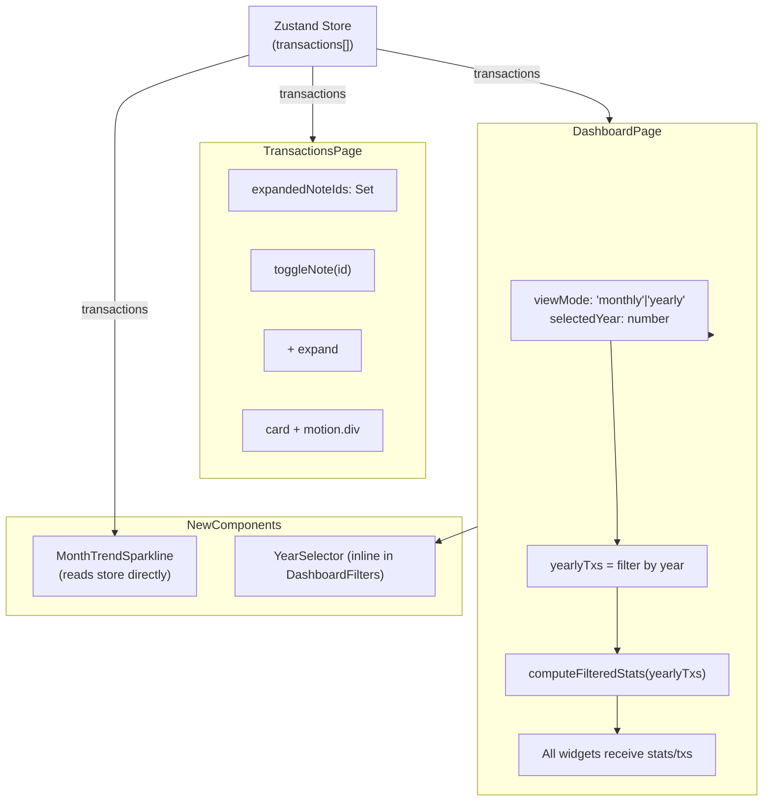

# Design Document — dashboard-enhancements

## Overview

Three pure-frontend enhancements to PaisaPal:

1. **Notes Quick-View** — inline accordion on transaction rows/cards to read notes without opening the edit form.
2. **Month-over-Month Sparkline Widget** — new dashboard card showing spend trend across the last 6 months with a trend indicator.
3. **Yearly Dashboard View** — mode toggle that switches all dashboard widgets to show full-year aggregates, with year navigation.

No new dependencies, no API changes. Recharts, framer-motion, lucide-react, and Zustand are already present.

---

## Architecture



### Key design decisions

- `expandedNoteIds` is local state in `TransactionsPage` — no store pollution.
- `MonthTrendSparkline` reads `transactions` from the store itself, bypassing `filteredTxs`, so it always shows the full 6-month picture regardless of dashboard filters.
- `viewMode` / `selectedYear` live in `DashboardPage` local state (no persistence needed).
- `computeYearlyTrend` is added to `dashboardUtils.ts` alongside existing helpers.
- Monthly state (`selectedMonth`, `dayFilter`, `selectedCategories`) is never reset when toggling to yearly — switching back restores it automatically since those state variables are untouched.

---

## Components and Interfaces

### Feature 1 — Notes Quick-View

#### State added to `TransactionsPage`

```ts
const [expandedNoteIds, setExpandedNoteIds] = useState<Set<string>>(new Set())

const toggleNote = useCallback((id: string) => {
  setExpandedNoteIds(prev => {
    const next = new Set(prev)
    if (next.has(id)) next.delete(id)
    else next.add(id)
    return next
  })
}, [])
```

#### Desktop: extra `<tr>` below each data row

```tsx
// Inside <AnimatePresence> wrapping the <tbody>
<motion.tr key={tx.id} ...>
  {/* existing cells */}
  <td className="px-4 py-3 text-muted-foreground text-xs max-w-[150px] truncate">
    {tx.notes?.trim() ? (
      <button
        onClick={() => toggleNote(tx.id)}
        aria-label={expandedNoteIds.has(tx.id) ? 'Hide notes' : 'Show notes'}
        className="flex items-center gap-1 text-muted-foreground hover:text-foreground transition-colors"
      >
        <ChevronDown
          className={`h-3.5 w-3.5 transition-transform duration-200 ${
            expandedNoteIds.has(tx.id) ? 'rotate-180' : ''
          }`}
        />
      </button>
    ) : '—'}
  </td>
  {/* actions cell unchanged */}
</motion.tr>

{expandedNoteIds.has(tx.id) && tx.notes?.trim() && (
  <motion.tr
    key={`${tx.id}-notes`}
    initial={{ opacity: 0, height: 0 }}
    animate={{ opacity: 1, height: 'auto' }}
    exit={{ opacity: 0, height: 0 }}
    transition={{ duration: 0.18 }}
  >
    <td colSpan={9} className="px-6 pb-3 pt-0">
      <p className="rounded-lg bg-secondary/60 px-3 py-2 text-xs text-foreground whitespace-pre-wrap">
        {tx.notes}
      </p>
    </td>
  </motion.tr>
)}
```

#### Mobile card addition

Below the existing card content, inside `<AnimatePresence>`:

```tsx
{tx.notes?.trim() && (
  <button
    onClick={() => toggleNote(tx.id)}
    aria-label={expandedNoteIds.has(tx.id) ? 'Hide notes' : 'Show notes'}
    className="mt-2 flex items-center gap-1 text-xs text-muted-foreground hover:text-foreground"
  >
    <ChevronDown
      className={`h-3.5 w-3.5 transition-transform duration-200 ${
        expandedNoteIds.has(tx.id) ? 'rotate-180' : ''
      }`}
    />
    <span>Notes</span>
  </button>
)}

<AnimatePresence>
  {expandedNoteIds.has(tx.id) && tx.notes?.trim() && (
    <motion.div
      key={`${tx.id}-notes-mobile`}
      initial={{ opacity: 0, height: 0 }}
      animate={{ opacity: 1, height: 'auto' }}
      exit={{ opacity: 0, height: 0 }}
      transition={{ duration: 0.18 }}
      className="overflow-hidden"
    >
      <p className="mt-2 rounded-lg bg-secondary/60 px-3 py-2 text-xs text-foreground whitespace-pre-wrap">
        {tx.notes}
      </p>
    </motion.div>
  )}
</AnimatePresence>
```

#### Import addition

```ts
import { ChevronDown, /* existing icons */ } from 'lucide-react'
```

---

### Feature 2 — `MonthTrendSparkline` (new file)

**File:** `src/components/dashboard/MonthTrendSparkline.tsx`

#### Data types

```ts
export interface SparklineDataPoint {
  month: string   // "YYYY-MM"
  total: number   // sum of transaction amounts in that month
  label: string   // "Jan '25"
}
```

#### Computation (inside component, via `useMemo`)

```ts
const sparklineData = useMemo((): SparklineDataPoint[] => {
  const months = getAvailableMonths(transactions) // already sorted newest-first
  const recent = months.slice(0, 6).reverse()     // oldest-first for chart
  return recent.map(month => {
    const { totalSpend } = computeMonthMetrics(transactions, month)
    const [y, m] = month.split('-')
    const label = new Date(parseInt(y), parseInt(m) - 1).toLocaleDateString('en-IN', {
      month: 'short',
      year: '2-digit',
    }) // "Jan '25"
    return { month, total: totalSpend, label }
  })
}, [transactions])
```

#### Trend indicator logic

```ts
const trendInfo = useMemo(() => {
  if (sparklineData.length < 2) return null
  const oldest = sparklineData[0].total
  const newest = sparklineData[sparklineData.length - 1].total
  if (oldest === 0) return { direction: 'neutral' as const, pct: null, oldestLabel: sparklineData[0].label }
  const pct = Math.round(Math.abs(newest - oldest) / oldest * 100)
  const direction = newest >= oldest ? 'up' : 'down'
  return { direction, pct, oldestLabel: sparklineData[0].label }
}, [sparklineData])
```

#### Full component signature

```ts
// No props — reads store directly
export function MonthTrendSparkline(): JSX.Element
```

#### Chart (mirrors `DailyTrend` pattern)

```tsx
<AreaChart data={sparklineData} margin={{ top: 5, right: 5, left: -20, bottom: 0 }}>
  <defs>
    <linearGradient id="sparkGrad" x1="0" y1="0" x2="0" y2="1">
      <stop offset="5%"  stopColor="hsl(var(--primary))" stopOpacity={0.3} />
      <stop offset="95%" stopColor="hsl(var(--primary))" stopOpacity={0}   />
    </linearGradient>
  </defs>
  <XAxis dataKey="label" tick={{ fontSize: 10, fill: 'hsl(var(--muted-foreground))' }}
         axisLine={false} tickLine={false} />
  <YAxis tickFormatter={v => `₹${v}`} tick={{ fontSize: 10, fill: 'hsl(var(--muted-foreground))' }}
         axisLine={false} tickLine={false} />
  <Tooltip content={<SparklineTooltip />} cursor={{ stroke: 'hsl(var(--border))' }} />
  <Area type="monotone" dataKey="total" stroke="hsl(var(--primary))"
        strokeWidth={2} fill="url(#sparkGrad)" />
</AreaChart>
```

#### Tooltip component (inline)

```tsx
function SparklineTooltip({ active, payload, label }: TooltipProps<number, string>) {
  if (!active || !payload?.length) return null
  return (
    <div className="rounded-lg border border-border bg-card px-2.5 py-2 text-xs shadow-xl">
      <div className="font-medium text-foreground">{label}</div>
      <div className="mt-1 flex items-center justify-between gap-3">
        <span className="text-muted-foreground">Total</span>
        <span className="font-semibold text-foreground">{formatCurrency(payload[0].value as number)}</span>
      </div>
    </div>
  )
}
```

#### TrendIndicator rendering

```tsx
{trendInfo && (
  <div className="flex items-center gap-1.5 text-xs">
    {trendInfo.direction === 'up' && (
      <ArrowTrendingUp className="h-3.5 w-3.5 text-[hsl(var(--danger))]" />
    )}
    {trendInfo.direction === 'down' && (
      <ArrowTrendingDown className="h-3.5 w-3.5 text-emerald-500" />
    )}
    {trendInfo.pct !== null ? (
      <span className={trendInfo.direction === 'up' ? 'text-[hsl(var(--danger))]' : 'text-emerald-500'}>
        {trendInfo.pct}% vs {trendInfo.oldestLabel}
      </span>
    ) : (
      <span className="text-muted-foreground">No baseline</span>
    )}
  </div>
)}
```

#### Empty state

```tsx
{sparklineData.length < 2 && (
  <p className="text-xs text-muted-foreground text-center py-8">
    Not enough data — need at least 2 months of transactions.
  </p>
)}
```

#### Placement in `DashboardPage`

Add after the existing ROW 1 (DailyTrend + CumulativeSpend), before the category row, as a full-width widget in monthly mode. In yearly mode it is hidden (the yearly DailyTrend already shows monthly buckets):

```tsx
{viewMode === 'monthly' && (
  <motion.div variants={item}><MonthTrendSparkline /></motion.div>
)}
```

---

### Feature 3 — Yearly View

#### New state in `DashboardPage`

```ts
const [viewMode, setViewMode] = useState<'monthly' | 'yearly'>('monthly')
const [selectedYear, setSelectedYear] = useState<number>(() => new Date().getFullYear())
```

#### Available years (derived)

```ts
const availableYears = useMemo(() => {
  const years = new Set<number>()
  transactions.forEach(t => {
    const dk = t.dateKey || t.date
    years.add(parseInt(dk.slice(0, 4)))
  })
  return Array.from(years).sort()
}, [transactions])
```

#### Yearly transactions and stats

```ts
const yearlyTxs = useMemo(() => {
  if (viewMode !== 'yearly') return []
  return transactions.filter(t => {
    const dk = t.dateKey || t.date
    return parseInt(dk.slice(0, 4)) === selectedYear
  })
}, [transactions, viewMode, selectedYear])

const yearlyStats = useMemo(() => computeFilteredStats(yearlyTxs), [yearlyTxs])
```

#### Active stats/transactions (used by widgets)

```ts
const activeStats = viewMode === 'yearly' ? yearlyStats : filteredStats
const activeTxs   = viewMode === 'yearly' ? yearlyTxs   : filteredTxs
```

All existing widgets are changed to use `activeStats` / `activeTxs`.

#### `computeYearlyTrend` — new utility function in `dashboardUtils.ts`

```ts
export interface YearlyTrendPoint {
  date: string   // "YYYY-MM"
  total: number
}

export function computeYearlyTrend(
  transactions: Transaction[],
  year: number,
): YearlyTrendPoint[] {
  const yearStr = String(year)
  const monthMap = new Map<string, number>()
  for (let m = 1; m <= 12; m++) {
    monthMap.set(`${yearStr}-${String(m).padStart(2, '0')}`, 0)
  }
  transactions.forEach(t => {
    const dk = t.dateKey || toLocalDateKey(t.date)
    if (!dk.startsWith(yearStr)) return
    const monthKey = dk.slice(0, 7)
    monthMap.set(monthKey, (monthMap.get(monthKey) ?? 0) + t.amount)
  })
  return Array.from(monthMap.entries())
    .map(([date, total]) => ({ date, total }))
    .sort((a, b) => a.date.localeCompare(b.date))
}
```

#### `DailyTrend` in yearly mode

`DailyTrend` currently reads `stats.byDate`. In yearly mode we pass a synthetic `Stats` object where `byDate` is the output of `computeYearlyTrend`. Since `Stats.byDate` is `{ date: string; total: number }[]`, the types are fully compatible:

```ts
const yearlyTrendStats = useMemo<Stats | null>(() => {
  if (!yearlyStats) return null
  return {
    ...yearlyStats,
    byDate: computeYearlyTrend(yearlyTxs, selectedYear),
  }
}, [yearlyStats, yearlyTxs, selectedYear])
```

Pass `viewMode === 'yearly' ? yearlyTrendStats : filteredStats` to `DailyTrend`.

#### Updated `DashboardFilters` props

```ts
interface Props {
  // existing
  dayFilter: DayFilter
  setDayFilter: (f: DayFilter) => void
  selectedMonth: string
  setSelectedMonth: (m: string) => void
  availableMonths: string[]
  categories: string[]
  selectedCategories: Category[]
  setSelectedCategories: (cats: Category[]) => void
  // new
  viewMode: 'monthly' | 'yearly'
  setViewMode: (m: 'monthly' | 'yearly') => void
  selectedYear: number
  setSelectedYear: (y: number) => void
  availableYears: number[]
}
```

#### `DashboardFilters` rendering logic

```tsx
<div className="flex flex-wrap items-center gap-3 mb-6">

  {/* ViewMode pill toggle — always visible */}
  <div className="flex items-center rounded-xl bg-secondary p-1 gap-0.5">
    {(['monthly', 'yearly'] as const).map(mode => (
      <button
        key={mode}
        onClick={() => setViewMode(mode)}
        className={`rounded-lg px-3 py-1.5 text-xs font-medium transition-all ${
          viewMode === mode
            ? 'bg-primary text-primary-foreground shadow-sm'
            : 'text-muted-foreground hover:text-foreground'
        }`}
      >
        {mode === 'monthly' ? 'Month' : 'Year'}
      </button>
    ))}
  </div>

  {/* Monthly controls — hidden in yearly mode */}
  {viewMode === 'monthly' && (
    <>
      {/* existing Month Navigator */}
      {/* existing Day Type Switch */}
      {/* existing CategoryFilterDropdown */}
    </>
  )}

  {/* YearSelector — shown in yearly mode */}
  {viewMode === 'yearly' && (
    <div className="flex items-center gap-1 rounded-xl bg-secondary px-1 py-1">
      <button
        onClick={() => setSelectedYear(y => y - 1)}
        disabled={!availableYears.includes(selectedYear - 1)}
        className="rounded-lg p-1.5 text-muted-foreground hover:text-foreground hover:bg-muted disabled:opacity-30 disabled:cursor-not-allowed transition-colors"
        aria-label="Previous year"
      >
        <ChevronLeft className="h-4 w-4" />
      </button>
      <span className="text-sm font-medium text-foreground px-2 min-w-[60px] text-center">
        {selectedYear}
      </span>
      <button
        onClick={() => setSelectedYear(y => y + 1)}
        disabled={selectedYear >= new Date().getFullYear()}
        className="rounded-lg p-1.5 text-muted-foreground hover:text-foreground hover:bg-muted disabled:opacity-30 disabled:cursor-not-allowed transition-colors"
        aria-label="Next year"
      >
        <ChevronRight className="h-4 w-4" />
      </button>
    </div>
  )}
</div>
```

#### Conditional widget rendering in `DashboardPage`

```tsx
{/* BudgetRing — hidden in yearly mode */}
{viewMode === 'monthly' && <BudgetRing stats={activeStats} />}

{/* MonthlyComparison — hidden in yearly mode, rendered outside the stagger grid */}
{viewMode === 'monthly' && (
  <motion.div variants={item} className="mt-3">
    <MonthlyComparison />
  </motion.div>
)}

{/* SpendingCalendar — only meaningful in monthly mode */}
{viewMode === 'monthly' && (
  <motion.div variants={item}>
    <SpendingCalendar transactions={activeTxs} selectedMonth={selectedMonth} />
  </motion.div>
)}
```

`SpendingCalendar` is specific to a single month, so it is also hidden in yearly mode. All other widgets (`CategoryDonut`, `TopCategories`, `AvgTransactionByCategory`, `CategoryModeSplit`, `QuickStats`, `RecentTransactions`, `SpendingHeatmap`, `WeeklySpendingHeatmap`, `WeeklySpendSummary`, `CumulativeSpend`, `DailyTrend`) receive `activeStats` / `activeTxs` and render in both modes without modification.

---

## Data Models

### `SparklineDataPoint`

```ts
interface SparklineDataPoint {
  month: string   // "YYYY-MM"
  total: number   // ≥ 0
  label: string   // "Jan '25"
}
```

### `TrendInfo`

```ts
type TrendInfo =
  | { direction: 'up' | 'down'; pct: number;   oldestLabel: string }
  | { direction: 'neutral';     pct: null;      oldestLabel: string }
  | null   // fewer than 2 data points
```

### `YearlyTrendPoint`

```ts
interface YearlyTrendPoint {
  date: string   // "YYYY-MM" — always 12 entries for a full year
  total: number  // 0 for months with no transactions
}
```

### No new persisted models

All new data is derived at render time from `transactions[]` in the store.

---

## Correctness Properties

*A property is a characteristic or behavior that should hold true across all valid executions of a system — essentially, a formal statement about what the system should do. Properties serve as the bridge between human-readable specifications and machine-verifiable correctness guarantees.*

### Property 1: Notes affordance matches notes presence

*For any* list of transactions, the set of transactions that render an ExpandAffordance icon should be exactly the set of transactions whose `notes` field, after trimming whitespace, is non-empty.

**Validates: Requirements 1.1, 1.2**

---

### Property 2: Notes accordion toggle is a round trip

*For any* transaction with non-empty notes, toggling the ExpandAffordance twice (expand then collapse) should leave `expandedNoteIds` in the same state as before any interaction.

**Validates: Requirements 2.1, 2.4**

---

### Property 3: Expanded accordion shows correct notes content

*For any* transaction with non-empty notes, after toggling it open, the rendered accordion should contain the full, unmodified `notes` string of that transaction.

**Validates: Requirements 2.2**

---

### Property 4: Multiple accordions can be open simultaneously

*For any* set of transactions with non-empty notes, toggling each one open independently should result in all of them being present in `expandedNoteIds` at the same time.

**Validates: Requirements 2.5**

---

### Property 5: Sparkline data covers at most 6 months, all with transactions

*For any* `transactions` array, `computeSparklineData(transactions)` should return an array of length `min(6, monthsWithData)`, where every returned data point's month has at least one transaction in the store.

**Validates: Requirements 4.1**

---

### Property 6: Sparkline totals equal sum of transaction amounts per month

*For any* `transactions` array and any month `m` returned in `computeSparklineData`, the `total` field should equal the arithmetic sum of `amount` across all transactions whose `dateKey` (or `date`) starts with `m`.

**Validates: Requirements 4.3**

---

### Property 7: Sparkline data is ordered chronologically

*For any* `transactions` array, `computeSparklineData(transactions)` should return data points sorted in ascending order by the `month` field (oldest-to-newest).

**Validates: Requirements 5.1**

---

### Property 8: Trend indicator direction matches newest vs oldest total

*For any* sparkline dataset with at least 2 data points and `oldest.total > 0`, the `direction` in `computeTrendInfo` should be `'up'` if `newest.total >= oldest.total` and `'down'` otherwise.

**Validates: Requirements 6.2, 6.3**

---

### Property 9: Trend indicator percentage formula

*For any* two totals `oldest > 0` and `newest ≥ 0`, `computeTrendInfo` should return `pct = Math.round(Math.abs(newest - oldest) / oldest * 100)`.

**Validates: Requirements 6.1, 6.5**

---

### Property 10: Yearly trend has exactly 12 data points

*For any* `transactions` array and any `year`, `computeYearlyTrend(transactions, year)` should return exactly 12 data points, one for each month January–December, sorted chronologically.

**Validates: Requirements 9.3**

---

### Property 11: Yearly totals equal sum of matching transactions

*For any* `transactions` array and any `year`, the sum of all `total` values in `computeYearlyTrend(transactions, year)` should equal the arithmetic sum of `amount` across all transactions whose `dateKey` year component equals `year`.

**Validates: Requirements 9.1, 9.6**

---

### Property 12: Year navigation preserves monthly state

*For any* monthly state (selectedMonth, dayFilter, selectedCategories), switching `viewMode` to `'yearly'` and back to `'monthly'` should leave all three monthly state values unchanged.

**Validates: Requirements 10.1**

---

### Property 13: Available years are derived from transaction data

*For any* `transactions` array, `availableYears` should be exactly the set of distinct integer year values extracted from each transaction's `dateKey`, with no extras or omissions.

**Validates: Requirements 8.2**

---

## Error Handling

| Scenario | Behavior |
|---|---|
| `transactions` is empty | `getAvailableMonths` returns `[]`; sparkline shows empty state; yearly selector has no years to navigate to |
| Fewer than 2 months of data | `MonthTrendSparkline` renders empty-state message, no chart |
| `oldest.total === 0` in trend | `computeTrendInfo` returns `direction: 'neutral', pct: null`; component renders "No baseline" |
| Selected year has no transactions | `yearlyStats` is `null`; existing `noData` guard in `DashboardPage` triggers, shows "No transactions found" message |
| `computeYearlyTrend` called for a year with partial data | Returns 12 data points; months with no transactions get `total: 0` |
| `dateKey` is absent on a transaction | All helpers fall back to `toLocalDateKey(t.date)` — consistent with existing `dashboardUtils.ts` pattern |

---

## Testing Strategy

### Unit tests

Focus on pure functions and edge cases that property tests don't cover:

- `computeYearlyTrend` returns 12 points for any year, sorted correctly
- `computeYearlyTrend` with empty transactions returns 12 zero-total points
- `computeTrendInfo` returns `null` for arrays shorter than 2
- `computeTrendInfo` returns `direction: 'neutral'` when `oldest.total === 0`
- `computeSparklineData` returns empty array for empty transactions
- Tooltip formatter produces correct output for known inputs
- Year label formatter produces `"Jan '25"` format
- `DashboardFilters` renders "Month" and "Year" pill options
- `DashboardFilters` in yearly mode renders `YearSelector`, not month navigator
- `DashboardFilters` defaults to monthly view on mount
- `BudgetRing` and `MonthlyComparison` are absent from DOM when `viewMode === 'yearly'`
- `BudgetRing` and `MonthlyComparison` are present when `viewMode === 'monthly'`
- ExpandAffordance button has correct `aria-label` in both expanded and collapsed states
- `formOpen` remains `false` after clicking ExpandAffordance (notes toggle does not open form)
- Empty-state message renders when sparkline has fewer than 2 data points
- Prev year button disabled when `selectedYear` equals min available year
- Next year button disabled when `selectedYear` equals current calendar year

### Property-based tests

Use a property-based testing library (recommended: `fast-check` — already commonly used with Vitest):

Each property test must run a minimum of 100 iterations.

```
// Tag format: Feature: dashboard-enhancements, Property N: <property_text>
```

**Property 1** — `Feature: dashboard-enhancements, Property 1: notes affordance matches notes presence`
Generate a random array of transactions with arbitrary `notes` values (mix of empty strings, whitespace-only, and non-empty). Render the component and assert: ExpandAffordance is present iff `notes.trim()` is non-empty.

**Property 2** — `Feature: dashboard-enhancements, Property 2: notes accordion toggle is a round trip`
For any transaction with non-empty notes, call `toggleNote(id)` twice and assert `expandedNoteIds` equals its initial state.

**Property 3** — `Feature: dashboard-enhancements, Property 3: expanded accordion shows correct notes content`
Generate a random transaction with non-empty notes. Toggle open. Assert rendered text equals `tx.notes`.

**Property 4** — `Feature: dashboard-enhancements, Property 4: multiple accordions open simultaneously`
Generate N transactions (N ≥ 2) all with non-empty notes. Toggle each open. Assert all IDs are in `expandedNoteIds`.

**Property 5** — `Feature: dashboard-enhancements, Property 5: sparkline data covers at most 6 months with transactions`
Generate a random `transactions` array. Assert `computeSparklineData` length ≤ 6 and each returned month has ≥ 1 transaction.

**Property 6** — `Feature: dashboard-enhancements, Property 6: sparkline totals equal sum of transaction amounts per month`
Generate a random `transactions` array. For each returned data point, assert `total === transactions.filter(month match).reduce(sum of amount, 0)`.

**Property 7** — `Feature: dashboard-enhancements, Property 7: sparkline data is ordered chronologically`
Generate a random `transactions` array. Assert returned data points are sorted ascending by `month` string.

**Property 8** — `Feature: dashboard-enhancements, Property 8: trend indicator direction matches newest vs oldest`
Generate random `oldest > 0` and `newest ≥ 0`. Assert `direction === 'up'` iff `newest >= oldest`.

**Property 9** — `Feature: dashboard-enhancements, Property 9: trend indicator percentage formula`
Generate random `oldest > 0` and `newest ≥ 0`. Assert `pct === Math.round(Math.abs(newest - oldest) / oldest * 100)`.

**Property 10** — `Feature: dashboard-enhancements, Property 10: yearly trend has exactly 12 data points`
Generate a random `transactions` array and a random `year`. Assert `computeYearlyTrend(transactions, year).length === 12` and months are sorted Jan–Dec.

**Property 11** — `Feature: dashboard-enhancements, Property 11: yearly totals equal sum of matching transactions`
Generate a random `transactions` array and a random `year`. Assert the sum of all data point totals equals the sum of amounts for transactions in that year.

**Property 12** — `Feature: dashboard-enhancements, Property 12: year navigation preserves monthly state`
Set arbitrary monthly state, toggle `viewMode` to `'yearly'`, toggle back to `'monthly'`. Assert `selectedMonth`, `dayFilter`, and `selectedCategories` are unchanged.

**Property 13** — `Feature: dashboard-enhancements, Property 13: available years derived from transaction data`
Generate a random `transactions` array. Assert `availableYears` equals the set of distinct year integers from all `dateKey` values, sorted ascending.
