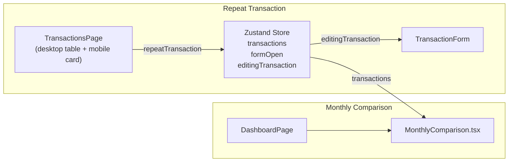

# Design Document — repeat-transaction-monthly-comparison

## Overview

This document covers the technical design for two frontend-only features added to the PaisaPal expense tracker:

1. **Repeat Transaction** — a one-click action that opens the Add Transaction form pre-filled with an existing transaction's data, but with today's date and no id, so the user can save it as a brand-new transaction.

2. **Monthly Comparison Widget** — a new dashboard section (`MonthlyComparison.tsx`) that lets the user pick 2–3 months and compare spending side-by-side via a grouped bar chart and plain-language summary row.

No API changes, new dependencies, or schema changes are required. Recharts (v2.15.4) is already present. All state lives in the existing Zustand store.

---

## Architecture

Both features are purely frontend. The data flow is:

```
Zustand store (transactions, formOpen, editingTransaction)
       │
       ├── TransactionsPage  ──► RepeatAction button
       │        └── calls repeatTransaction(tx) → openForm(partialTx)
       │
       ├── TransactionForm
       │        └── detects repeat mode via: editingTransaction && !editingTransaction.id
       │
       └── DashboardPage
                └── MonthlyComparison (reads store.transactions directly)
                         └── computeMonthMetrics utility
                         └── Recharts BarChart
```



---

## Components and Interfaces

### 1. Store — `repeatTransaction` action

Added directly to `useStore` in `src/store/index.ts`.

```ts
// Added to AppStore interface
repeatTransaction: (tx: Transaction) => void

// Implementation
repeatTransaction: (tx) => {
  const today = toLocalDateKey(new Date())
  get().openForm({
    ...tx,
    id: undefined as unknown as string, // signal: no id = repeat mode
    date: today,
    dateKey: today,
  })
},
```

`openForm` already accepts `Transaction | undefined`. Passing an object with `id` set to `undefined` works because `openForm` stores whatever it receives in `editingTransaction`. The form then checks `!!editingTransaction?.id` to decide between edit and add paths — `undefined` evaluates to `false`, so it correctly falls into "add" mode.

> Design decision: Rather than adding a separate `isRepeatMode` flag to the store, we reuse the existing `editingTransaction` slot. The rule is: `editingTransaction !== null && !editingTransaction.id` → repeat mode. This keeps the store minimal.

---

### 2. TransactionForm — repeat mode detection

The current logic is:

```ts
const isEditing = !!editingTransaction
```

This is changed to:

```ts
const isEditing = !!(editingTransaction?.id)
```

This is the only logic change required. The `useEffect` that calls `form.reset()` already handles pre-filling from `editingTransaction`, so when a repeat-mode object arrives (no id, but has particulars/amount/etc.), the form populates all fields and sets date to today.

The title already uses `isEditing ? 'Edit Transaction' : 'Add Transaction'` — with the updated `isEditing` check, it will display "Add Transaction" in repeat mode. The submit button label and submit handler similarly use `isEditing` and need no further changes.

---

### 3. TransactionsPage — RepeatAction button

Import `repeatTransaction` from the store. Add a `CopyPlus` (or `Repeat`) icon button from `lucide-react` alongside the existing Pencil/Trash2 buttons.

Desktop table (inside the actions `<td>`), normal (non-deleting) state:

```tsx
import { repeatTransaction, isSnapshotView } from useStore(...)
// ...
<button
  onClick={() => repeatTransaction(tx)}
  aria-label="Repeat transaction"
  disabled={isSnapshotView}
  className="rounded-lg p-1.5 text-muted-foreground hover:bg-secondary hover:text-foreground transition-colors disabled:opacity-40 disabled:cursor-not-allowed"
>
  <CopyPlus className="h-3.5 w-3.5" />
</button>
```

Mobile card (inside the actions `<div>`), normal state:

```tsx
<button
  onClick={() => repeatTransaction(tx)}
  aria-label="Repeat"
  disabled={isSnapshotView}
  className="p-1 text-muted-foreground disabled:opacity-40"
>
  <CopyPlus className="h-3.5 w-3.5" />
</button>
```

Both buttons are placed between the Edit and Delete buttons. When `isSnapshotView` is true, the buttons render with `disabled` attribute and reduced opacity — matching the pattern used on the Import and Add buttons in the same file.

---

### 4. Utility — `computeMonthMetrics`

A new pure function added to `src/lib/dashboardUtils.ts`:

```ts
export interface MonthMetrics {
  month: string          // "YYYY-MM"
  totalSpend: number
  byCategory: Record<string, number>
  dailyAverage: number   // totalSpend / count of distinct active days
  transactionCount: number
  byMode: { Online: number; Cash: number; Card: number }
  topCategory: string
}

export function computeMonthMetrics(
  transactions: Transaction[],
  month: string,           // "YYYY-MM"
): MonthMetrics {
  const txs = transactions.filter(t => {
    const dk = t.dateKey || toLocalDateKey(t.date)
    return dk.startsWith(month)
  })

  const totalSpend = txs.reduce((s, t) => s + t.amount, 0)
  const transactionCount = txs.length

  const catMap: Record<string, number> = {}
  for (const t of txs) {
    catMap[t.category] = (catMap[t.category] ?? 0) + t.amount
  }

  const activeDays = new Set(txs.map(t => t.dateKey || toLocalDateKey(t.date))).size
  const dailyAverage = activeDays > 0 ? totalSpend / activeDays : 0

  const byMode = { Online: 0, Cash: 0, Card: 0 }
  for (const t of txs) byMode[t.mode] += t.amount

  const topCategory = Object.entries(catMap).sort((a, b) => b[1] - a[1])[0]?.[0] ?? ''

  return { month, totalSpend, byCategory: catMap, dailyAverage, transactionCount, byMode, topCategory }
}
```

---

### 5. MonthlyComparison component

**File:** `src/components/dashboard/MonthlyComparison.tsx`

```ts
// Props: none — reads directly from store
// Internal state
const [selectedMonths, setSelectedMonths] = useState<string[]>(defaultMonths)
const [activeMetric, setActiveMetric] = useState<MetricTab>('totalSpend')

type MetricTab = 'totalSpend' | 'byCategory' | 'dailyAverage' | 'transactionCount' | 'byMode'
```

**Month selection logic:**

```ts
const allMonths = useMemo(() => getAvailableMonths(transactions), [transactions])

const defaultMonths = useMemo(() => {
  if (allMonths.length >= 2) return allMonths.slice(0, 2)  // 2 most recent
  return [...allMonths]                                      // all if < 2
}, [allMonths])
```

Toggle handler enforces the 2–3 constraint:

```ts
function toggleMonth(m: string) {
  setSelectedMonths(prev => {
    if (prev.includes(m)) {
      if (prev.length <= 2) return prev          // ignore deselect below 2
      return prev.filter(x => x !== m)
    }
    if (prev.length >= 3) return prev             // ignore 4th selection
    return [...prev, m].sort().reverse()
  })
}
```

**Metric computation:**

```ts
const metrics = useMemo(
  () => selectedMonths.map(m => computeMonthMetrics(transactions, m)),
  [transactions, selectedMonths]
)
```

**Chart data shape** varies by active metric tab:

- `totalSpend` / `dailyAverage` / `transactionCount` → single bar per month:
  ```ts
  // data = [{ month: 'Jan 25', value: 4200 }, { month: 'Feb 25', value: 3800 }]
  // <BarChart> with one <Bar dataKey="value" />
  ```

- `byCategory` → one bar per category, grouped by month:
  ```ts
  // Collect all categories across selected months
  // data = [{ category: 'Food & Drinks', 'Jan 25': 1200, 'Feb 25': 900 }, ...]
  // <BarChart> with one <Bar dataKey={monthLabel} /> per selected month
  ```

- `byMode` → one bar per mode, grouped by month (same structure as byCategory but 3 fixed keys)

**Summary row formula:**

```ts
// For scalar metrics (totalSpend, dailyAverage, transactionCount):
const values = metrics.map(m => getScalarValue(m, activeMetric))
const min = Math.min(...values)
const max = Math.max(...values)
const pct = max > 0 ? Math.round((max - min) / max * 100) : 0
const cheapestMonth = metrics[values.indexOf(min)].month
// "YYYY-MM" to display label
```

Summary row only renders when `selectedMonths.length >= 2` and the active metric has a scalar comparison (byCategory and byMode show no summary row, as multi-series comparison has no single "cheapest month").

---

### 6. DashboardPage integration

`MonthlyComparison` is imported and rendered as the last child inside the `<motion.div>` grid, after the last existing row. It is placed outside the `noData` guard because it has its own empty-state handling.

```tsx
import { MonthlyComparison } from '@/components/dashboard/MonthlyComparison'

// After the last motion.div grid row, inside the outer motion.div:
<motion.div variants={item}>
  <MonthlyComparison />
</motion.div>
```

`MonthlyComparison` reads `transactions` from the store internally — it does not receive `filteredTxs` or `filteredStats` as props.

---

## Data Models

No new persisted data models. All computation is derived from the existing `Transaction[]` in the store.

**`MonthMetrics`** (local, computed on render):

| Field | Type | Description |
|---|---|---|
| `month` | `string` | `YYYY-MM` |
| `totalSpend` | `number` | Sum of all amounts |
| `byCategory` | `Record<string, number>` | Amount keyed by category |
| `dailyAverage` | `number` | totalSpend / active days |
| `transactionCount` | `number` | Count of transactions |
| `byMode` | `{ Online, Cash, Card: number }` | Amount per payment mode |
| `topCategory` | `string` | Category with highest spend |

---

## Correctness Properties

*A property is a characteristic or behavior that should hold true across all valid executions of a system — essentially, a formal statement about what the system should do. Properties serve as the bridge between human-readable specifications and machine-verifiable correctness guarantees.*

### Property 1: repeatTransaction strips id and sets today's date

*For any* transaction `tx` in the store, calling `repeatTransaction(tx)` must result in `editingTransaction` having `particulars`, `amount`, `category`, `mode`, and `notes` equal to the corresponding fields of `tx`, and `date` equal to today's local date (`toLocalDateKey(new Date())`), and no truthy `id` field.

**Validates: Requirements 1.1, 1.8**

---

### Property 2: RepeatAction button calls repeatTransaction for any transaction in any layout

*For any* transaction rendered in the desktop table or mobile card list, clicking its RepeatAction button must invoke `repeatTransaction` with exactly that transaction object (not a different transaction from the list).

**Validates: Requirements 1.2, 1.3**

---

### Property 3: Snapshot view disables RepeatAction for any transaction

*For any* transaction and any state where `isSnapshotView` is `true`, the RepeatAction button for that transaction must be rendered with the `disabled` attribute.

**Validates: Requirement 1.7**

---

### Property 4: Metric selection constraints are enforced for any selection sequence

*For any* sequence of month toggle operations starting from a valid selection (2–3 months), the resulting `selectedMonths` array must always contain between 2 and 3 months — attempts to deselect below 2 are ignored, and attempts to add a 4th are ignored.

**Validates: Requirements 2.4, 2.5, 2.6**

---

### Property 5: Total spend computation is the arithmetic sum of amounts

*For any* set of transactions belonging to a given month, `computeMonthMetrics(transactions, month).totalSpend` must equal the exact arithmetic sum of all `amount` fields across those transactions.

**Validates: Requirements 3.1, 3.4**

---

### Property 6: Daily average is totalSpend divided by active day count

*For any* set of transactions belonging to a given month, `computeMonthMetrics(transactions, month).dailyAverage` must equal `totalSpend / (count of distinct dateKey values in that month)`. When there are zero active days, dailyAverage must be 0.

**Validates: Requirements 3.1, 3.5**

---

### Property 7: Per-category spend is the grouped sum of amounts

*For any* set of transactions belonging to a given month, for each category `c`, `computeMonthMetrics(transactions, month).byCategory[c]` must equal the sum of `amount` for all transactions in that month whose `category === c`.

**Validates: Requirements 3.1, 3.6**

---

### Property 8: SummaryRow percentage formula

*For any* two ComparisonMonths A and B with scalar metric values `vA` and `vB` where `vA < vB`, the rendered SummaryRow percentage must equal `Math.round((vB - vA) / vB * 100)` percent.

**Validates: Requirement 4.4**

---

## Error Handling

**Empty transaction list:** `computeMonthMetrics` called with zero matching transactions returns all-zero metrics. `MonthlyComparison` renders an empty-state message ("No transaction data for selected months") instead of an empty chart.

**Fewer than 2 available months:** The widget renders with the single available month selected (or a prompt to add more transactions if zero months). The SummaryRow is suppressed.

**`isSnapshotView`:** The repeat transaction button is disabled — no additional guard is needed in the store action itself since `openForm` and `addTransaction` are still callable in snapshot view, but the UI entry point is blocked.

**Invalid `dateKey`:** `computeMonthMetrics` falls back to `toLocalDateKey(t.date)` when `t.dateKey` is absent — consistent with the existing pattern in `dashboardUtils.ts` and `store/index.ts`.

---

## Testing Strategy

Both unit tests and property-based tests are required and complementary.

**Unit tests** (`vitest` + `@testing-library/react`):
- Verify specific examples and edge cases
- Cover UI interactions (tab switching, button clicks, snapshot view)
- Test the title "Add Transaction" in repeat mode (Requirement 1.5)
- Test that `addTransaction` is called (not `updateTransaction`) on repeat submit (Requirement 1.6)
- Test `MonthlyComparison` default month selection with ≥2 and <2 months of data
- Test SummaryRow is absent when only 1 month is selected
- Test `DashboardPage` renders `MonthlyComparison` as the last section

**Property-based tests** (`fast-check`, already a natural fit with vitest):
- Each correctness property above maps to exactly one property-based test
- Minimum 100 iterations per test (fast-check default is 100, use `{ numRuns: 100 }`)
- Tag format comment above each test: `// Feature: repeat-transaction-monthly-comparison, Property N: <property text>`

**Property test library:** `fast-check` (install as dev dependency; API is `fc.assert(fc.property(...))`)

**Example property test skeleton:**

```ts
// Feature: repeat-transaction-monthly-comparison, Property 1: repeatTransaction strips id and sets today's date
it('repeatTransaction: editingTransaction has no id and date is today', () => {
  fc.assert(
    fc.property(arbitraryTransaction(), (tx) => {
      const store = createTestStore()
      store.getState().repeatTransaction(tx)
      const et = store.getState().editingTransaction
      expect(et).not.toBeNull()
      expect(et!.id).toBeFalsy()
      expect(et!.date).toBe(toLocalDateKey(new Date()))
      expect(et!.particulars).toBe(tx.particulars)
      expect(et!.amount).toBe(tx.amount)
    }),
    { numRuns: 100 }
  )
})
```

```ts
// Feature: repeat-transaction-monthly-comparison, Property 5: total spend is arithmetic sum
it('computeMonthMetrics: totalSpend equals sum of amounts', () => {
  fc.assert(
    fc.property(fc.array(arbitraryTransaction({ month: '2025-01' }), { minLength: 0, maxLength: 50 }), (txs) => {
      const metrics = computeMonthMetrics(txs, '2025-01')
      const expected = txs.reduce((s, t) => s + t.amount, 0)
      expect(metrics.totalSpend).toBe(expected)
    }),
    { numRuns: 100 }
  )
})
```

Unit tests are located in `src/tests/` or co-located under `__tests__/` per existing project convention. Property tests live in the same files, tagged with the property number comment.
